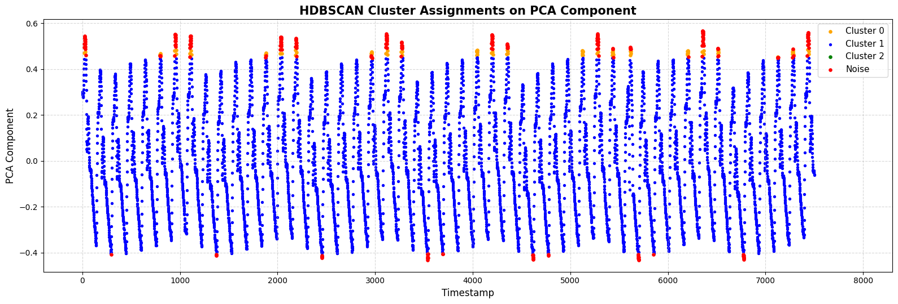

<!-- Your exemplar title. Make it sound catchy! -->
# ReCoDE Exemplar - Data-Scarce Behavioural Anomaly Detection

<!-- A brief description of your exemplar, which may include an image -->
This exemplar provides a complete pipeline for unsupervised anomaly detection applied to univariate time series data. Using the InternalBleeding14 dataset from the UCR Time Series Anomaly Archive, the project demonstrates techniques for detecting irregular patterns in physiological-style sensor recordings, where normal operating conditions are occasionally interrupted by anomalous deviations. The exemplar guides learners through data preparation, preprocessing, Isolation Forest modelling, dimensionality reduction with PCA, clustering with HDBSCAN, model interpretation, and ethical considerations when analysing scarce or sensitive time series data. The exemplar is fully modular, industry-aligned, and reproducible for academic and applied machine learning use cases.



(Visual representative image to be inserted - PCA cluster visualisation with anomaly overlays will be included after Week 6 visual refinement.)

This exemplar was developed at Imperial College London by Duke T J Ludera in collaboration with Saranjeet Kaur S S Bhogal from Research Software Engineering and
Dr. Jianliang Gao from Research Computing & Data Science at the Early Career Researcher Institute.

## Learning Outcomes 🎓

Upon completion, students will:

- Preprocess univariate time series data for anomaly detection.
- Implement Isolation Forest and HDBSCAN clustering in unsupervised anomaly detection contexts.
- Interpret model outputs, identify anomalous deviations, and reflect on ethical challenges in modelling scarce time series data.

## Target Audience 🎯

- Postgraduate students
- Early career data scientists
- Researchers working on time series analysis, anomaly detection, fraud detection, operational monitoring, or applied machine learning pipelines.

## Prerequisites ✅

### Academic 📚

- Python programming (intermediate level)
- Familiarity with machine learning (unsupervised models, clustering)
- Introductory understanding of anomaly detection and time series concepts

### System 💻

- Python 3.10+
- Anaconda or virtualenv recommended
- Disk space: ~2 GB
- RAM: 8 GB or higher
  
Hardware or HPC requirements

- Standard desktop or laptop (no HPC required)

## Getting Started 🚀

1. Clone this GitHub repository.
2. Install environment using provided requirements.txt file.
3. Launch Jupyter Notebook environment.
4. Work through notebooks in sequence:
```
notebooks/
├── 01_dataset_preparation.ipynb
├── 02_preprocessing_and_baseline_iforest.ipynb
├── 03_dimensionality_and_clustering.ipynb
├── 04_model_interpretation_and_explanation.ipynb
├── 05_ethical_reflection.ipynb
├── 06_visual_polishing_and_citations.ipynb
├── 07_reproducibility_and_environment_testing.ipynb
└── 08_finalised_summary_notebook.ipynb
```
5. Follow markdown guidance and exercises embedded within each notebook.
6. Review ethical reflection sections in Week 5.

## Disciplinary Background 🔬
     
This exemplar sits at the intersection of anomaly detection, unsupervised machine learning, and time series data science. While the dataset originates from physiological sensor measurements, it is applied here as a general case of unsupervised anomaly detection on sparse time series. The exemplar demonstrates practical techniques applicable to fraud detection, operational monitoring, industrial equipment diagnostics, and public sector data analysis.


## Software Tools 🛠️

- Python 3.x
- pandas
- numpy
- scikit-learn
- HDBSCAN
- matplotlib
- seaborn

## Project Structure 🗂️
```
.
├── notebooks
│   ├── 01_dataset_preparation.ipynb
│   ├── 02_preprocessing_and_baseline_iforest.ipynb
│   ├── 03_dimensionality_and_clustering.ipynb
│   ├── 04_model_interpretation_and_explanation.ipynb
│   ├── 05_ethical_reflection.ipynb
│   ├── 06_visual_polishing_and_citations.ipynb
│   ├── 07_reproducibility_and_environment_testing.ipynb
│   └── 08_finalised_summary_notebook.ipynb
├── src
│   └── (core model modules — optional extension)
├── data
│   └── InternalBleeding14.csv
├── docs
├── utils
├── test
├── LICENSE.md
├── README.md
├── requirements.txt
├── mkdocs.yml
└── .github/workflows
```

## Code Organisation

notebooks/ — step-by-step Jupyter notebooks following weekly structure.

src/ — reusable model code extensions (optional).

data/ — dataset files.

docs/ — documentation for deployment.

utils/ — helper scripts.

test/ — testing scripts.

github/workflows/ — GitHub CI/CD automation.

## Roadmap 🗺️

### Core 🧩

- Dataset ingestion and preprocessing
- Baseline Isolation Forest anomaly detection
- PCA dimensionality reduction
- HDBSCAN clustering
- Model interpretation and markdown commentary
- Visualisation of anomaly scores and clustering
- Ethical reflection module
- Fully reproducible codebase with documentation
  
**Updates:**  
- Week 6 (16–23 June): Improved markdown structure and visual commentary in Notebooks 01–03; added method citations and cleaned invalid notebook versions; updated file paths to reflect new folder structure.
- Week 7 (24–30 June): Added requirements.txt environment file for reproducibility.
- Week 8 (1–7 July): Finalised README polish, dataset documentation, and ensured consistency of file structure and links.


### Extensions 🔌

- Behavioural data augmentation (SMOTE, jittering, scaling, warping)
- Advanced ethical scenario analysis
- Visualisation refinement for industry or academic presentation
- Regulatory audit integration for compliance-sensitive applications

## Data 📊

List datasets used with:

- Dataset: InternalBleeding14
- Description: Univariate physiological-style time series used for anomaly detection benchmark tasks.
- Source: UCR Time Series Anomaly Archive (2021)
- Licence: Public benchmark dataset
- Location: Included in repository


## Best Practice Notes 📝

- Version controlled via GitHub
- GitHub Projects used for task tracking
- Clean notebook structure aligned to Imperial ReCoDE 10-week schedule
- Embedded markdown reflections for ethical context
- BSD-3-Clause licence for reproducibility and reuse

## Estimated Time ⏳

| Task       | Estimated Time    |
| ---------- | ----------------- |
| Reading    | 3 hours           |
| Practising | 3 hours           |


## Additional Resources 🔗

- Wu, R., & Keogh, E. (2020). Current Time Series Anomaly Detection Benchmarks are Flawed and are Creating the Illusion of Progress. arXiv:2009.13807.
- scikit-learn official documentation
- HDBSCAN official documentation
- Imperial College London ReCoDE Exemplar Guide

## Licence 📄

BSD-3-Clause License
