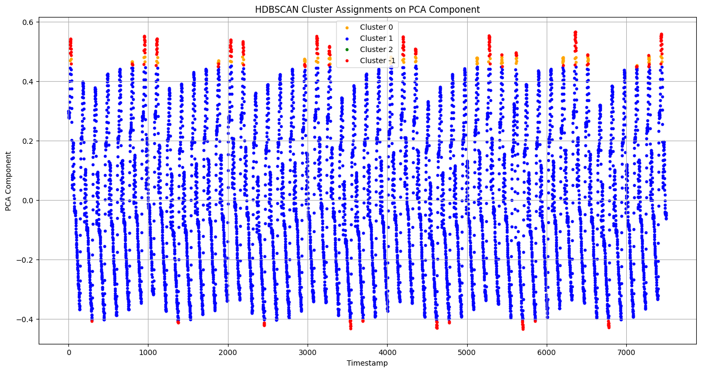

# ReCoDE Exemplar - Data-Scarce Time Series Anomaly Detection




## Overview

This exemplar provides a complete pipeline for unsupervised anomaly detection applied to univariate time series data. Using the InternalBleeding14 dataset from the UCR Time Series Anomaly Archive, the project demonstrates techniques for detecting irregular patterns in physiological-style sensor recordings, where normal operating conditions are occasionally interrupted by anomalous deviations. The exemplar guides learners through data preparation, preprocessing, Isolation Forest modelling, dimensionality reduction with PCA, clustering with HDBSCAN, model interpretation, and ethical considerations when analysing scarce or sensitive time series data. The exemplar is fully modular, industry-aligned, and reproducible for academic and applied machine learning use cases.

## Dataset

- **Dataset name:** InternalBleeding14  
- **Source:** UCR Time Series Anomaly Archive  
- **Citation:**  
  ▪ Wu, R., & Keogh, E. (2020). *Current Time Series Anomaly Detection Benchmarks are Flawed and are Creating the Illusion of Progress.* arXiv:2009.13807

## Weekly Structure

- **Week 1:** Dataset loading, conversion and justification  
- **Week 2:** Preprocessing and baseline Isolation Forest  
- **Week 3:** PCA visualisation and HDBSCAN clustering  
- **Week 4:** Model interpretation with markdown explanations  
- **Week 5:** Ethical reflection on anomalies and data scarcity  
- **Week 6:** Visual polishing and markdown refinement  
- **Week 7:** Environment file and reproducibility tests  
- **Week 8:** Final README, dataset framing, and documentation  
- **Week 9:** Review and minor corrections  
- **Week 10:** Final submission and packaging

## Tools Used

- Python 3.x
- pandas
- numpy
- scikit-learn
- HDBSCAN
- matplotlib
- seaborn

## Repository Structure

```
.
├── notebooks
│ ├── 01_dataset_preparation.ipynb
│ ├── 02_preprocessing_and_baseline_iforest.ipynb
│ ├── 03_dimensionality_and_clustering.ipynb
│ ├── 04_model_interpretation_and_explanation.ipynb
│ ├── 05_ethical_reflection.ipynb
│ ├── 06_visual_polishing_and_citations.ipynb
│ ├── 07_reproducibility_and_environment_testing.ipynb
│ └── 08_finalised_summary_notebook.ipynb
├── data
│ └── InternalBleeding14.csv
├── src
├── docs
├── utils
├── test
├── LICENSE.md
├── README.md
├── requirements.txt
├── mkdocs.yml
└── .github/workflows
```


## Licensing

BSD-3-Clause License


## Acknowledgements

This exemplar was developed at *Imperial College London* by **Duke T. J. Ludera**, in collaboration with *Saranjeet Kaur S. S. Bhogal* from Research Software Engineering, and *Dr Jianliang Gao* from Research Computing & Data Science at the Early Career Researcher Institute.
